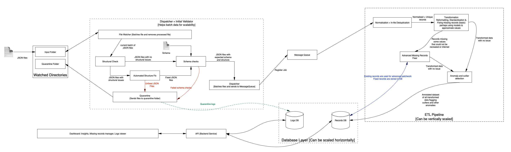

__Runtime__: [3 days]: Sat, 0ct 4th, 2025 10:15am  - Tue, Oct 7th, 2025 10:15am

### RUNNING THIS SOLUTION

- [Standalone]: For Data Exploration and Analysis kindly run all cells of the `exploration.ipynb` notebook

The following steps are related:  
- [STEP 1]: Ensure you have `docker` installed and `docker-compose`.
- [STEP 2]: Navigate to the sub-directory `<project-root>/duel-api`
- [STEP 3]: Configure the `.env` file accordingly. This file has been filled for you, feel free to update it if you wish
- [STEP 4]: Run `docker-compose up` via the terminal: This should set up the `postgresql database`, `pgAdmin` & `duel-api` services.
- [STEP 5]: Navigate to the subdirectory `<project-root>/dispatcher-and-etl`
- [STEP 6]: Configure the `.env` file accordingly. It is importannt that `DATA_FOLDER` points to the folder where the `JSON` files are stored while `QUARANTINE_FOLDER` points to a folder where JSON files may be moved to (ideally, it should be an empty directory, but not necessarily)
- [STEP 7]: Ensure you have `python` and `pip3` installed and available in your `path`.
- [STEP 8]: Run the command `pip3 install -r requirement.txt` to install all requirements
- [STEP 9]: Run `python dispatcher.py` to run the dispatcher: This should scan all JSON file for structure and schema integrity
- [STEP 10]: RUN `python pipeline.py` to run the ETL pipeline: This should transform the read files and store them in the `postgresql` database setup in [STEP 4] above
- [STEP 11]: Using a browser, navigate to `http://localhost:3030` to access the dashboard
- [STEP 12]: Access `http://localhost:3030/api` to access the API endpoints without the dashboatd

### SOME NOTES BEFORE YOU BEGIN

#### Assumptions Made:

- No two tasks share the same id: all tasks with the same id refer to the same task
- No two programs share the same id: all programs with the same id refer to the same program
- Post urls are unique to user and task: No two tasks can share the same post url -- it ties to a post a user has made on a platform towards one and only one task.

#### Limitation of the Data and Potential expansion:

- Programs List: A list of programs would have allowed filtering out tasks that do not belong to any known program
- Task List: A list of tasks would allow for ensuring the program-task relationships are valid
- No timestamps: Beyond `joined_at`, there is no timing information. If we had timing information, we could potentially see if performance changes based on time of the year and or time of the day which would allow for greater insights. For example, we could see how engagement changes from months to month and are affected by events

#### Approach and Thought process
- For thoughts on the exploration stage, please refer to the notebook `exploration.ipynb` in the root directory.
- [Data Processing + ETL Pipeline](processing.md): Details the steps taken to process the data are in the file `processing.md` in the root directory. Additionally comments have been added through-out the codebase to explain my thinking.
- 

#### Constraints and Future Work
A lot more could have been done but the time was insufficient to complete them.
- For scalability, I would have created a `dispatcher` that would listen to changes in the `samples directory` and batch them. These batches will be tested for structural and schema conformance and quarantined where they do not meet such. The rest of the batch will then be passed to a MessageQueue which instances of the ETL pipeline are registred to. The idea being that if we batch the jobs we can horizontally scale the ETL pipeline as required. The batch size will also determine how soon we can start seeing data on the dashboard. For this demonstration this was left out due to time constraint. On the bringhtside, running the entire pipeline on the 10000 records took < 30secs on my dev computer which is has 8gb of RAM, it means testing the pipeline wont eat too much of your time :)
- Due to time constraint, the dispatcher and ETL service were not containerised and need to be run directly on the host machine or via a notebook.
- Due to time constraints, I have implemented a single page dashboard using AngularJS (angular 1) this is because it is far quicker to prototype in angularJS than other frameworks or at least it is for me in comparison to the latest release of angular and/or react.
- Go has been used for the backend API because I'm implementing a pet project in Go currently and thought I might as well squeeze in more practice.

#### My envisioned solution
Due to constraints, I scaled down the solution but the image below summarises the key points:

